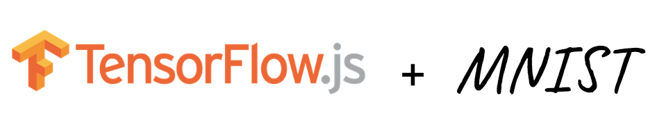

## [](https://js.tensorflow.org/)

### [Try the Live Demo](https://bit.ly/mco-mnist-draw)

# mnist-draw
This repository contains a single page website that enables users to draw digits (0-9) by hand and 
have the digits classified in real time as they are drawn by a machine learning model trained against
the [MNIST](https://en.wikipedia.org/wiki/MNIST_database) dataset.

# Setup 
Python 3.5+ is required for compatibility with all required modules

```bash
# Clone this repository
git clone https://github.com/marcacohen/mnist-draw.git

# Change to the repo root directory
cd mnist-draw

# Install required modules
pip install -r requirements.txt
```

# Usage
To launch the website, begin by starting a Python server from the repository folder:
```bash
# Start Python server (use Python 3)
python -m http.server --cgi 8000
```
Then open a browser and navigate to `http://localhost:8000/`. 

An example of the website's interface is shown below. Users are guided to draw a digit (0-9) on the empty
canvas and watch the page try to classify your digit as you draw.

Results are displayed as a bar graph where each classification label recieves a score between 0.0 and 1.0 from the machine learning model. Clear the canvas with the 'Clear' button to draw and process other digits.  

Interface example: 
<p>
  
</p>

## Machine Learning Model
The model I'm using for this page a convolutional neural network (CNN) built using Keras/TensorFlow on a
Google Tensor Processing Unit (TPU).
The model is explained in depth and is available for you to build yourself [here](bit.ly/mco-mnist-lab).

## Acknowledgements

Thanks to rhammell for the original Python version and to zackakil for adding support for Tensorflow.js.
In this version I added predicting while you draw, deployed the example UI on Cloud Run (bit.ly/mco-mnist-draw),
and deployed a Colab notebook (bit.ly/mco-mnist-lab) so you can build your own version of this model, 
with the UI widget integrated right into the notebook.
